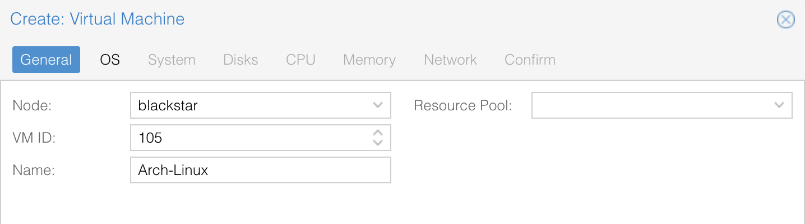
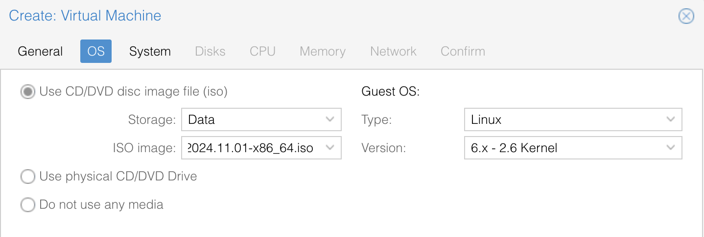
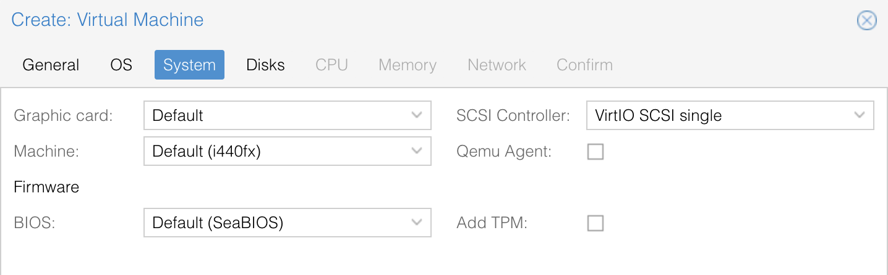
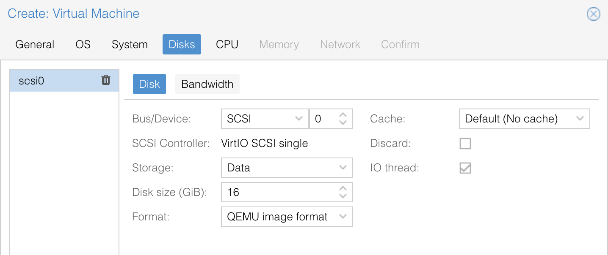
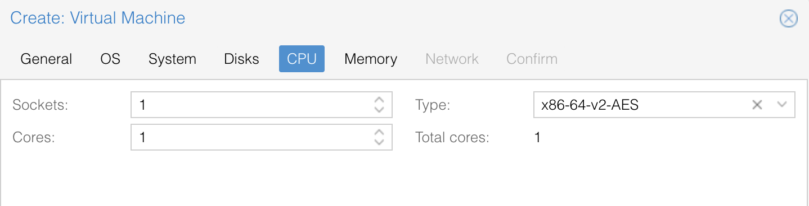
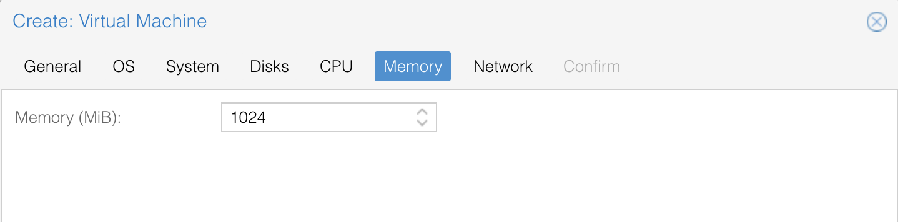
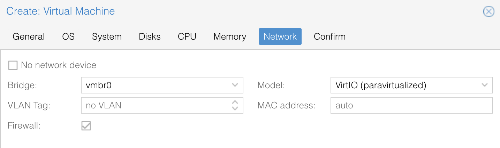
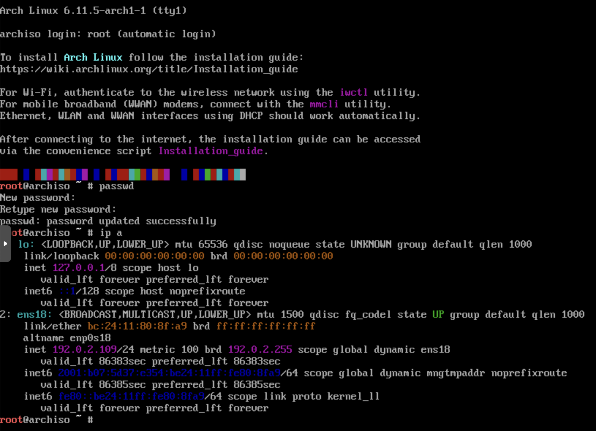

### First steps

Setup:
- virtualization infra: Proxmox v. 8.2
- ISO file: archlinux-2024.11.01-x86_64.iso

**NOTE**: the steps won't be very different with other hypervisors or, even, a bare metal host.<br/>

The installation takes place in two separate phases:<br/>
a. the VM is deployed by means of the hypervisor (Proxmox console)<br/>
b. the rest of the installation happens through SSH<br/>
Although in a concise way, I'll document the steps and what they achieve.<br/>

#### First phase: minimal VM creation and essential setup
As a starting point a VM must be created in Proxmox VE with the following characteristics:
- General > name: feel free to pick any name :)


- OS > ISO image: select the .iso file you've previously uploaded to the data store


- System: leave untouched. For more info on BIOS vs EFI read [this document](https://wiki.archlinux.org/title/Arch_boot_process)


- Disks > Disk size: for a test VM my piece of advice is to lower the value to 16GiB


- CPU: 1 is enough for a demonstrational VM


- Memory: 1024MiB, see previous comment


- Network: leave untouched


Once the VM creation process will start, open the Console and, in a few seconds, you'll be greeted by the Linux prompt.


Only two things are left to be done while on Console:
1. set the root password with `passwd`
2. find the VM's IP address

The next steps will be carried out while connected with SSH from a separate host.<br/>

#### Second phase: connect via SSH and boot Arch Linux
3. connect via SSH to the IP address shown above, do not save the IP address among the local known SSH keys
```
% ssh -o StrictHostKeyChecking=no -o UserKnownHostsFile=/dev/null root@192.0.2.109
```

<br/>

4. verify we're in a `BIOS` (as opposed to `EFI`) environment (hint: see above)
```
root@archiso ~ # [ -d /sys/firmware/efi ] && echo "UEFI" || echo "BIOS"
BIOS
```

5. set time and date
```
root@archiso ~ # timedatectl set-ntp true

root@archiso ~ # timedatectl set-timezone <Region>/<City>
```

<br/>

6. partition the disk

**NOTE**: this is a somewhat complex step requiring deeper knowledge of disks, filesystems, etc. If you know what you're doing, here's my, again, super essential, partition scheme:<br/>

| Device | Boot | Start | End | Sectors | Size | Id  | Type |
| ------ | ---- | ----- | --- | ------- | ---- | --- | ---- |
| /dev/sda1 | - | 2048 | 1050623 | 1048576 | 512M | 83 | Linux |
| /dev/sda2 | - | 1050624 | 32507903 | 31457280 | 15G | 83 | Linux |
| /dev/sda3 | - | 32507904 | 33554431 | 1046528  | 511M | 82 | Linux swap / Solaris |

<br/>

7. create [Ext4](https://wiki.archlinux.org/title/Ext4) and [Swap](https://wiki.archlinux.org/title/Swap) partitions
```
root@archiso ~ # mkfs.ext4 /dev/sda1

root@archiso ~ # mkfs.ext4 /dev/sda2

root@archiso ~ # mkswap /dev/sda3

root@archiso ~ # swapon /dev/sda3
```

<br/>

8. mount `sda1` (`/boot`) and `sda2` (`/`) to temporary directories
```
root@archiso ~ # mount /dev/sda2 /mnt

root@archiso ~ # mount --mkdir /dev/sda1 /mnt/boot
```

<br/>

9. install into `/mnt` essential packages with `pacstrap` ("PAckage bootsSTRAP")
```
root@archiso ~ # pacstrap /mnt base base-devel linux linux-firmware
```
**NOTE**:
- `base`: core package group
- `base-devel`: development tools group (e.g.: `gcc`, `make`, `sudo`,...)
- `linux`: the Linux kernel package
- `linux-firmware`: essential firmware files

<br/>

10. generate [fstab](https://wiki.archlinux.org/title/Fstab)
```
root@archiso ~ # genfstab -U /mnt >> /mnt/etc/fstab
```

<br/>

11. [Chroot](https://wiki.archlinux.org/title/Chroot) into the new system
```
root@archiso ~ # arch-chroot /mnt
```

**NOTE**: notice how the prompt changes after the last command, we're now in a different `root` directory with its own settings.

- Before arch-chroot:
```
/ (installation media root)
└── mnt/ (your new system)
    ├── bin/
    ├── etc/
    ├── home/
    └── ...
```

- After arch-chroot:
```
/ (your new system)
├── bin/
├── etc/
├── home/
└── ...
```

<br/>

12. set timezone by creating a soft link, synchronize the VM's _hardware_ clock to the system's clock
```
[root@archiso /]# ln -sf /usr/share/zoneinfo/Europe/Rome /etc/localtime

[root@archiso /]# hwclock --systohc
```

<br/>

13. set the appropriate [locale](https://wiki.archlinux.org/title/Locale), for instance:
```
[root@archiso /]# sed -i "s/#en_US.UTF-8 UTF-8/en_US.UTF-8 UTF-8/" /etc/locale.gen

[root@archiso /]# locale-gen
```

<br/>

14. set a hostname
```
[root@archiso /]# echo "archlinux-nuc" > /etc/hostname
```

<br/>

15. install package `networkmanager`
```
[root@archiso /]# pacman -S networkmanager

[root@archiso /]# systemctl enable NetworkManager
```

**NOTE**: this is extremely important otherwise no networking will be available after reboot

<br/>

16. set password for user `root`
```
[root@archiso /]# passwd
```

<br/>

17. install a [bootloader](https://wiki.archlinux.org/title/Boot_loader) of your choice, e.g. `grub`
```
[root@archiso /]# pacman -S grub

[root@archiso /]# grub-install --target=i386-pc /dev/sda

[root@archiso /]# grub-mkconfig -o /boot/grub/grub.cfg
```

**NOTE**: the settings above depend on the `BIOS` vs. `EFI` choice made before. YMMV!

<br/>

18. leave the _chrooted_ environment, unmount the disk, **reboot**
```
[root@archiso /]# exit

root@archiso ~ # umount -R /mnt

root@archiso ~ # reboot
```

If the steps above have been followed properly, and no error messages have been returned, you should now have a minimal but working Arch Linux VM!<br/>

With this VM as your lab, don't stop! Keep experimenting and breaking/fixing things.<br/>

As for me, knowing that I can always _blindly_ spin a new VM gives me confidence to experiment even more.<br/>

