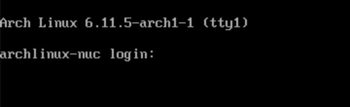

### Additional configuration

It's always a good thing to take a look at what happens when your freshly installed server reboots for the first time. 

Head back to the console and connect to the VM. On my systems, it takes only a few seconds to show the prompt. 

Let's login as `root`, the password has been setup in the [previous section](first.md) during step #16. 
