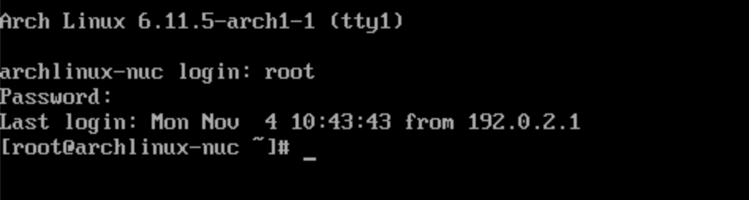

### Additional configuration

It's always a good thing to take a look at what happens when your freshly installed server reboots for the first time.<br/>

Head back to the console and connect to the VM. On my systems, it takes only a few seconds to show the prompt.<br/>



Let's login as `root`, the password has been setup in the [previous section](first.md) during step #17.<br/>

```
# useradd -m -G wheel <user>

# passwd <user>
```

The next step is to install OpenSSH to be able to reach the server remotely, as such:
```
# pacman -S openssh

# systemctl enable --now sshd

# sed -i "s/#PermitRootLogin prohibit-password/PermitRootLogin yes/" /etc/ssh/sshd_config

# systemctl restart sshd
```
**NOTE**: by default `root` is prohibited from connecting to the host, we need
